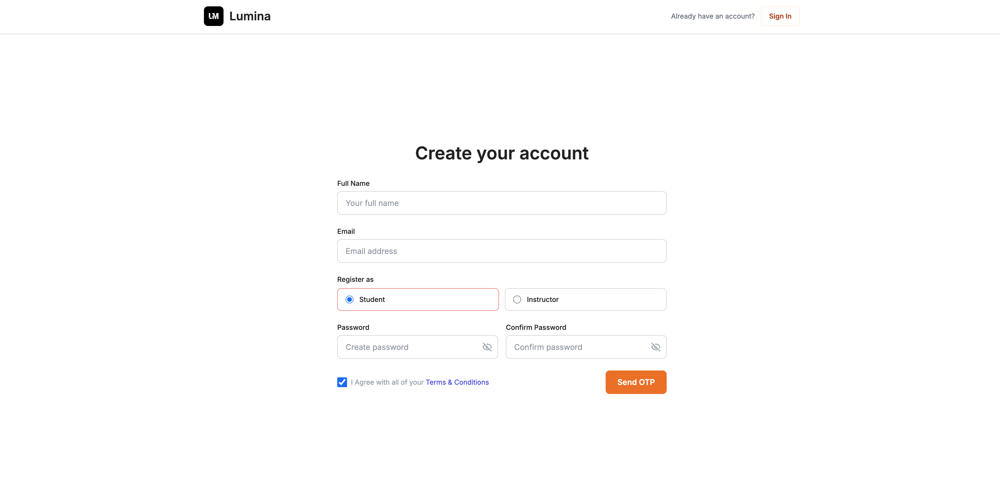
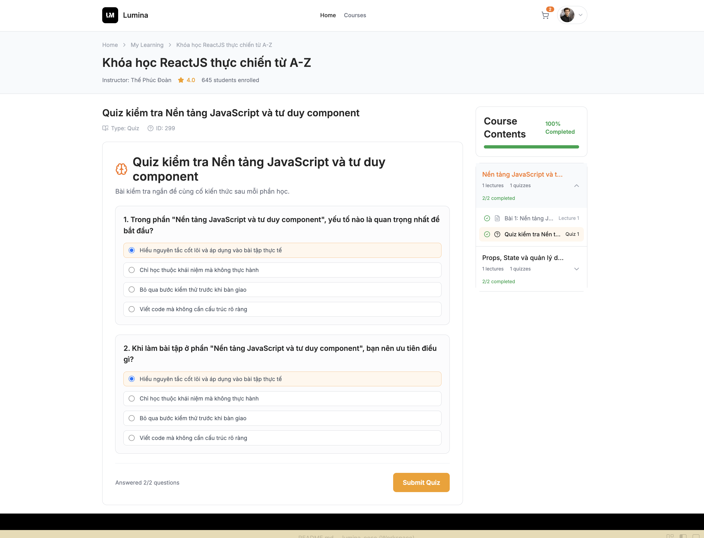
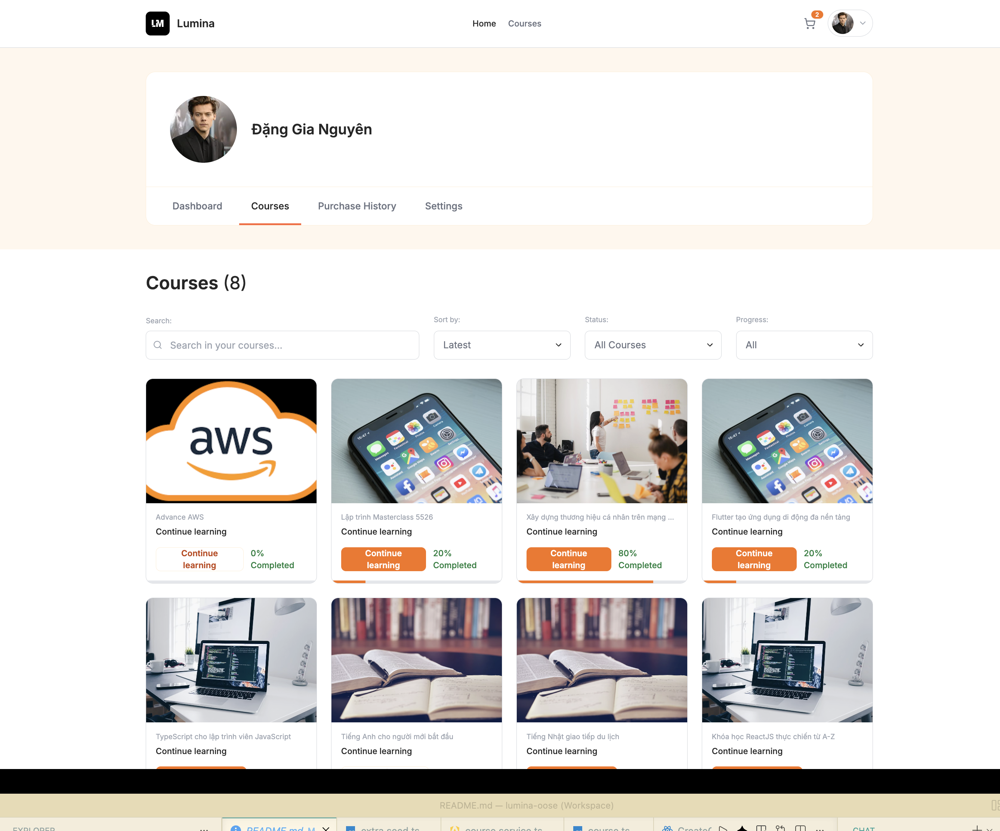
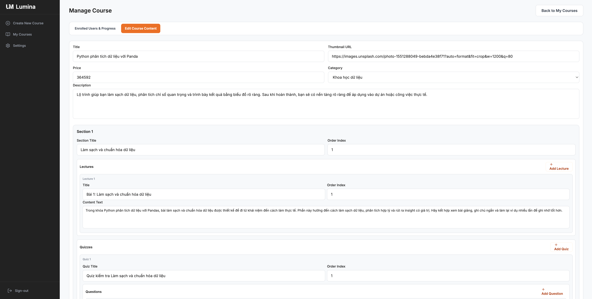
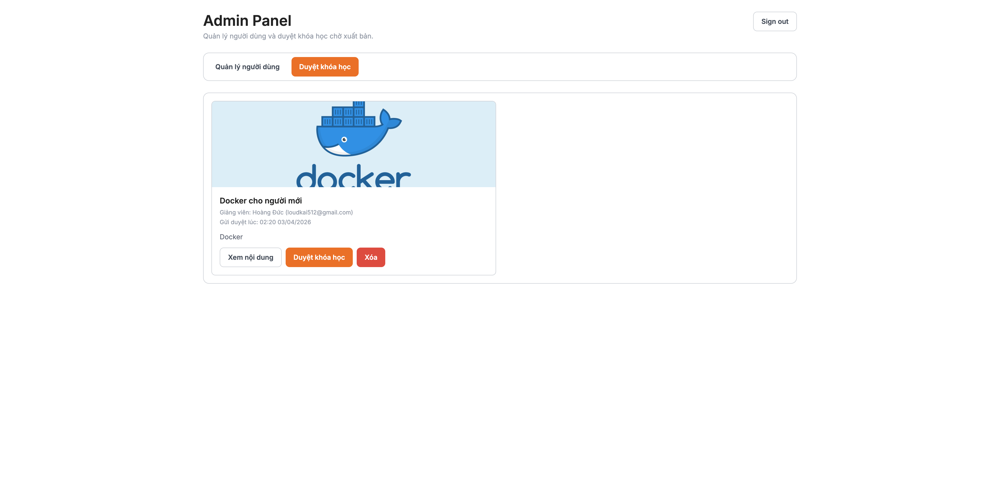

# Cinx E-learning Frontend

Frontend web application for the Lumina (Cinx) e-learning platform, integrated with the backend API.
The product focuses on a full learning marketplace experience across student, instructor, and admin roles.

## Table of Contents

- [Project Vision](#project-vision)
- [Feature Highlights](#feature-highlights)
- [Demo Gallery (Replace with Your Media)](#demo-gallery-replace-with-your-media)
- [Role-Based Experience](#role-based-experience)
- [Tech Stack](#tech-stack)
- [Frontend Architecture](#frontend-architecture)
- [App Flows](#app-flows)
- [Environment](#environment)
- [Setup and Run](#setup-and-run)
- [Build and Preview](#build-and-preview)
- [Scripts](#scripts)
- [API Integration Notes](#api-integration-notes)

## Project Vision

Lumina is designed as a practical learning ecosystem where users can discover, purchase, and complete online courses while instructors manage high-quality content and admins moderate platform quality.

This frontend is built to support production-like workflows rather than static mock pages.

## Feature Highlights

- Course discovery and exploration (categories, filtering, sorting, detail pages)
- Authentication and profile management
- Student learning journey (enrollment, progress, purchase history, reviews)
- Instructor workspace (course management, enrolled students, settings, review replies)
- Admin dashboard (user management and course moderation)

## Demo Gallery 

### 1) Product hero


### 2) Authentication flow (GIF)



### 3) Student experience





### 4) Instructor workspace (GIF)



### 5) Admin dashboard



## Role-based Experience

- `student`: browse, purchase, learn, and review courses.
- `instructor`: create and maintain courses, track learners, reply to reviews.
- `admin`: moderate users and approve pending courses.

Role guards and post-login redirects are applied to keep each experience isolated and secure.

## Tech Stack

- React 19 + TypeScript
- Vite
- React Router
- TanStack Query (React Query)
- Zustand
- Tailwind CSS
- Axios

## Frontend Architecture

- `src/pages`: domain-based page screens.
- `src/components`: reusable UI components.
- `src/layouts`: role-specific layout shells.
- `src/services`: API service layer.
- `src/hooks`: custom hooks and query hooks.
- `src/types`: shared API/data contracts.

Primary data flow:

`Page -> Hook/Query -> Service -> Axios -> Backend API`.

## App Flows

### Course discovery

1. User lands on Home and explores top categories.
2. User filters and sorts course listings.
3. User opens course details (curriculum + reviews).

### Instructor operations

1. Instructor updates course structure and content.
2. Instructor tracks enrolled learners and progress.
3. Instructor replies to student reviews from the manage course page.

### Admin moderation

1. Admin accesses the dedicated admin dashboard.
2. Admin reviews users by role.
3. Admin approves or removes pending courses.

## Environment

Create a `.env` file in the `fe` directory:

```env
VITE_API_URL=http://localhost:9090/api
VITE_ACCESS_TOKEN_KEY=accessToken
```

## Setup and Run

### 1) Install dependencies

```bash
npm install
```

### 2) Start dev server

```bash
npm run dev
```

Frontend runs on `http://localhost:5173` by default.

Note: backend should be running before frontend for API requests to work.

## Build and Preview

```bash
npm run build
npm run preview
```

## Scripts

- `npm run dev`: start development server.
- `npm run build`: type-check and build production bundle.
- `npm run preview`: preview production build locally.
- `npm run lint`: lint source code.

## API Integration Notes

- Frontend depends on backend API contracts from the `be` repository.
- When backend response shapes change, update `src/services` and `src/types` accordingly.
- Auth routes and role guards are core to business correctness and access control.
